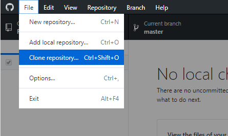
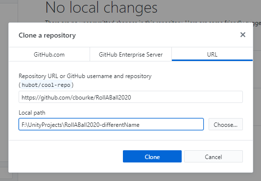
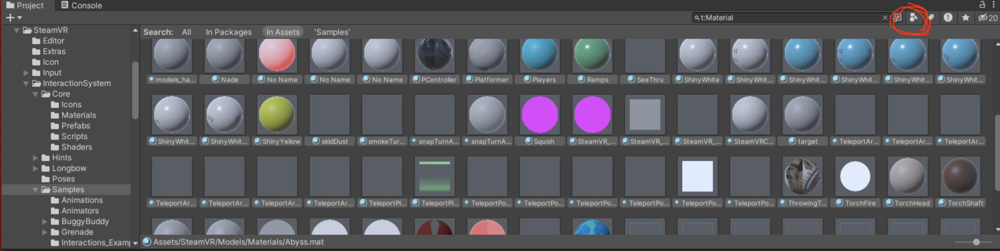

# Exploring Virtual Reality
## Module 1.0

**[School of Computing](https://computing.unl.edu/)**  
**[Johnny Carson Center for Emerging Media Arts](https://arts.unl.edu/carson-center/)**  
**[University of Nebraska-Lincoln](https://unl.edu)**  

# Introduction

Unity is a cross-platform game engine that provides an Integrated Development
Environment (IDE) with standard assets for developing both 2-D and 3-D games.
It is like a "Photoshop for game development" in that it doesn't require a lot
of programming to develop complex games. Unity also features an extensive online
community of developers as well as an extensive asset store that gives you access
to a lot of free (and paid) content (graphics, models, audio, etc.). In this
module, you will familiarize yourself with the basic usage of Unity and
collaboration using Git

# Installations

Both Unity and GitHub Desktop should already be installed on the classroom
computers.  However, you'll likely want to install them on your own computer
so you can work outside the lab.

## Unity

Install **Unity Hub** from <https://unity.com/download>.  Once installed, launch
the application and have it install the version of Unity that your instructor
directs you to.  This should install a .NET editor as well.  Be sure to install
all relevant "build support modules" (generally Windows will be sufficient).

## GitHub Desktop

Eventually you will need to collaborate with your fellow students to work
together on a project.  If you are already familiar and comfortable with
git you may use whatever client or process you like.  If you are new to
git, then we will walk you through how to use GitHub Desktop.  

1. Sign up for a free GitHub account at <https://github.com/>
2. Install the GitHub Desktop from <https://desktop.github.com/>

# Development

We'll start by running through a tutorial provided by the Unity development
team.  Many tutorials are available at https://learn.unity.com/ but to get
started, we'll run through the Roll-A-Ball tutorial (version 2022.3 recommended):

<https://learn.unity.com/course/roll-a-ball/unity-version?version=2022.3>

In total, this may take 2 hours to complete. Watch the videos and develop along
with them. Feel free to explore and make a few customizations if you like and
to consult and collaborate with your classmates.  

# Using Git

We will now publish your project on GitHub using the GitHub Desktop client. This
will ensure that you have a copy on GitHub and allow others to contribute and
collaborate on your project.

## Initialization

1. Create a new (empty) repository on <https://github.com>
2. Using the GitHub Desktop client *clone* your repository to your computer
3. Add a `.gitignore` file to the folder; an example can be found here:
https://raw.githubusercontent.com/github/gitignore/refs/heads/main/Unity.gitignore
   This will prevent unnecessary (and large) files from being committed to your
   repository.
4. Move your Unity project files over to this new folder (note: in Unity, you may
   need to add this project back in since it has changed folders).
5. In the GitHub Desktop client, the client should be aware of these new files.
   Write a descriptive message for this commit, say "Initial Commit" and
   commit/push.
6. Go to your repository on GitHub and refresh to verify all the files have now
   been uploaded to GitHub

## Making Changes

Now let's walk through the process of making changes and committing/pushing them
to your repo(sitory).  Using what you've learned in the tutorial, let's add
some additional pickup objects that not only "float" and rotate, but that move
around on the game board. In particular, we'll create a pick up object that
moves along a pre-defined line off to the side.

1. Duplicate one of the "pick up" game objects and move it to `(7.5,0.75,−7.5)`.
2. Add a new component (a C Sharp script) named `Pacer` and open it in an editor.
   Note: the script you wrote in the tutorial should remain; you can add as
   many scripts to game objects as you like.
3. Implement the script as given below.

```cs
using UnityEngine;
using System.Collections;

public class Pacer : MonoBehaviour {

  public float speed = 5.0f;
  private float zMax = 7.5f;
  private float zMin = -7.5f; //starting position
  private int direction = 1; //positive to start

  void Update () {
    float zNew = transform.position.z +
                 direction * speed * Time.deltaTime;
    if (zNew >= zMax) {
      zNew = zMax;
      direction *= -1;
    } else if (zNew <= zMin) {
      zNew = zMin;
      direction *= -1;
    }
    transform.position = new Vector3(7.5f, 0.75f, zNew);
  }
}
```

Let's understand this script.  The "Pick Up" object will travel along the
z-axis between `-7.5` and `7.5` (its x-axis and y-axis will remain unchanged).  
The speed determines how fast it "paces" the path.  Since we start at
`z = -7.5` we will start by traveling in the positive direction, which is
why the `direction` variable is a positive 1.

In the `Update()` function, we calculate and set the new position.  The new
z-axis value will be the old value, `transform.position.z` plus the `direction`
times the `speed` times `Time.deltaTime`.  The `Time.deltaTime` is the amount
of time it took to render the previous frame in Unity.  Moving objects relative
to time is better than moving them relative to the frame rate as the frame rate
can be variable and would result in a different experience depending on the
player's hardware.

Finally, we check to see if we've hit the maximum or the minimum z-axis values.  
If we have, we reset the z-axis value to the min or max and then change the
direction by multiplying it by `-1`.  Finally, we set the position to a new
vector with the new z-axis value.

4. Once you are sure your changes are working, in the GitHub Desktop client
   your changes should be detected.  Write a descriptive message and commint/push
   your changes to your repo(sitory).

# Collaborating

At this point you will need to team up with another student in the course, ask
your instructor to pair you with someone.

## Add a Collaborator

Add your partner to your project on GitHub:
1. In your repo on GitHub (webbrowser) click `Settings`
2. Click `Collaborators`
3. Enter your partner's GitHub user name and click `Add collaborator`
4. They should receive an email; make sure they accept the invitation

## Modifying Your Partner's Project

Now you will make changes to your partner's project and your partner will
make changes to your project.  Close your project for now and
we'll start working on your partner's project.

### Cloning your partner's project

First, we need to **clone** your partner's project (hosted on
GitHub) to your own computer.  

1. Open GitHub Desktop and login with your GitHub credentials
2. Go to `File` then `Clone repository`:



3. Select the `URL` tab



4. Enter the URL for **your partner's** repository that they added you as a
   collaborator on.
5. Be sure to set the `Local path` to the same directory as your other Unity
   project(s).  This is why it was important to use a different name as your
   partner; if you failed to do this, you can rename your local repository.
6. Click clone (you may be prompted to "Initialize Git LFS" but select `Not now`.  
7. In Unity Hub, select `Add` and select the folder of the project you just
   cloned.  Open the project.  You should be able to start making changes to
   the project without any further setup.

### Making Changes to your partner's project

Make a change to your partner's project.  There are *lots* of
creative and simple things you could do.  Do *at least one* of the
following suggestions and think of one additional change/feature of
your own and implement it.  You should work closely with your partner
if you need help, but you each should do different things to each other's
projects.

Suggestions:

* Add another pickup item that instead of traveling along a
  straight line, revolves around in a circle about the origin.  Hint:
  use a radius $r$ and an angle, $0 \leq \theta \leq 2\pi$ and then convert
  these polar coordinates to $xz$-coordinates using the following:
  $$x = r \cdot \sin{(\theta)}$$
  $$y = r \cdot \cos{(\theta)}$$
  In C Sharp you can use `using System;` to bring
  in a floating-point math library with methods such as
  `Mathf.Sin()`.

* Add another pickup item that randomly appears and reappears in
  different locations at a reasonable pace.  

  A simple way to do this is to keep a time counter and reset the
  $xz$-position to a random location when the counter hits a certain
  elapsed time (by adding `Time.deltaTime` on each
  frame render).  Alternatively, you could increment a counter in a
  `FixedUpdate` method instead.

  A `System.Random` object can be used
  to generate random numbers, in particular the `NextDouble()``
  function returns a random number in the range $[0, 1)$.

  A more advanced technique is to use a *coroutine* which is a
  special method (routine) that can `yield` its
  execution back to the main game routine.  Normally, a regular method
  (such as `Update()` executes entirely within a
  frame (thus computation intensive operations or procedural animations
  cannot be done without greatly affecting the gaming experience and
  frame rate).

  A coroutine can perform an operation and then yield control back
  to the main thread.  At some point in the future, control is returned
  back to the coroutine at the point at which it yielded, allowing
  it to continue its execution.  You can even yield for a specified
  amount of time using a `WaitForSeconds()` method.
  Full documentation an helpful examples can be found here:
  <https://docs.unity3d.com/Manual/Coroutines.html>

* Find a photo or an image of a pattern and then add it to your project
  as a new material for the ball and/or the ground.  You may find the
  answer to the following question useful:

  <http://answers.unity3d.com/questions/126746/make-pictures-into-a-material.html>

* Research how to bring in rendered assets from a program such as
  Maya or 3D Studio Max and replace the pickup cubes or other objects
  with them.

* Research how to add sound effects and add one for when the ball
  picks up an object.
* Think of your own customizations that you can add/modify and then research
  how to do it.

### Committing Changes

Once you have your working changes to your partner's project then in GitHub
Dekstop:
1. Write a descriptive message and commit/push your changes to GitHub
2. Verify that the changes were pushed by visiting your partner's GitHub repo
   via webbrowser.


## Pull your partner's changes to your project

Once partner has pushed their changes to your project, you will need to **pull**
them to your computer.
1. In the GitHub Desktop Client go to your project and `pull`
2. Open the project in Unity and verify that the changes work.

Congratulations!  You've successfully collaborated on a simple Unity game!
Shake hands and move on (separately) to the next module!

# Additional Tips

* Resolving merge conflicts can be challenging especially for
  binary assets.  It is easiest to develop not on a separate branch
  but in a separate scene in Unity and then you can "merge" new
  features into your main scenes in your project.
* If you import a package from the Asset Store but only use parts of it,
  you should delete the parts you do not use so as not to commit them
  to your repo.  You can hit the storage limits very quickly with
  binary artifacts.

# Troubleshooting

**Compiler errors are not highlighted in the VS Code editor**

Or automatic code completion may not be working.  You need to tell Unity to use
Visual Studio as its script editor.  In Unity:

`edit > preferences > external tools > external script editor > Visual Studio`

close and reopen Visual Studio.  If prompted, click `no` on the firewall prompt.

**In GitHub desktop you get a message like "LF will be replaced with CRLF" and it doesn't let you commit**

This happens because you made the *parent *folder/directory of your Unity
project into the git repo instead of the Unity project's folder.  Consequently,
the `.gitignore` file is not ignoring what it should be (and a bunch of
generated code/files are wanting to be committed).

The *quick* fix is to copy your `.gitignore` file into your Unity project
subfolder so it ignores everything with respect to that directory.
The *correct* fix is that next time you create a repo, make sure it is
done in the Unity project folder.  Generally there should be 1 Unity
project to 1 repo (otherwise you're gonna run out of room quick).

**Some of my rendered assets are Purpley**

If you have "purple" objects it is because the materials have not been converted
to URP (Universal Render Pipeline).  To fix this:

* In the lower right "search by type" and select material, then select all the
  materials and then go to `Edit > Rendering > Materials > Convert Selected to URP`
* OR, if you are using 2022:


